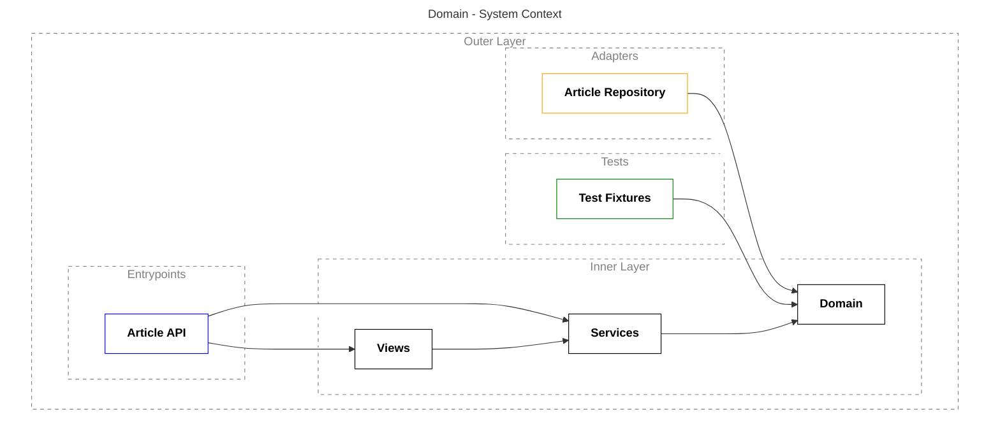

# Articles Microservice

Articles Microservice - это микросервис, управляющий статьями пользователей.
<br />
<br />

## Перед запуском проекта

#### Установка зависимостей

Используйте следующую команду для установки зависимостей:

```shell
poetry install
```

или вот такую для их обновления:

```shell
poetry update
```

#### Установка pre-commit

Используйте следующую команду для установки pre-commit:

```shell
make pre-commit
```

## Запуск проекта

Для прогона различных команд в проекте используется утилита `make`. Все её аргументы прописаны в соответствующем файле `Makefile`. Например, для запуска приложения просто выполните в терминале следующую команду:

```shell
make up
```

При этом создадутся переменные окружения, запустится контейнер с PostgreSQL, Alembic накатит миграции и, собственно, запустится само приложение.

Если вы не собираетесь использовать утилиту `make`, то имейте ввиду, что вам надо будет как-то иначе прописать все необходимые переменные окружения (на данный момент они прописаны в шапке файла `Makefile`), иначе не будет работать ни приложение, ни тесты, ни Alembic.
<br />
<br />

## Тестирование

Вы можете прогнать все тесты проекта либо так:

```shell
make test-app
```

либо так:

```shell
# для прогона всех тестов:
poetry run pytest tests/

# для прогона только лишь юнит-тестов:
poetry run pytest tests/unit/

# для прогона только лишь конкретного файла:
poetry run pytest tests/unit/test_commands.py

# для прогона только лишь конкретного класса с тестами:
poetry run pytest tests/unit/test_commands.py::TestCreateCategoryCommand

# для прогона только лишь конкретного теста:
poetry run pytest tests/unit/test_commands.py::TestCreateCategoryCommand::test_cannot_create_with_empty_category_name
# или, если тест располжен вне класса:
poetry run pytest tests/unit/test_commands.py::test_cannot_create_with_empty_category_name
```

Однако не забывайте, что если не использовать утилиту `make`, то вам придётся прописать переменные окружения как-то иначе, иначе тесты свалятся с ошибкой.
<br />
<br />

## Выполнение миграций базы данных

Сервис пока что не умеет выполнять обратные миграции, где происходят изменения столбцов базы данных, поэтому такие миграции мы пока не выполняем, так как это требует изменения кода приложения.

Сервис может выполнять обратные миграции, если добавляются или удаляется контентная часть таблицы, например, если происходит добавление или удаление продукта.
<br />
<br />

## Гексагональная архитектура

У нас есть некое ядро, вокруг которого строится всё остальное. Это ядро показано на диаграмме как `Inner Layer` и состоит из `Views`, `Services` и `Domain`.

`Domain` - это наш домен, то есть модель предметной области.
`Services` – это наши обработчики команд и событий.
`Views` - это наши представления, которые предоставляют нам доступ на чтение данных, относящихся к доменной области.

Наше ядро представляет собой зависимость для внешних конгломератов, таких как `Adapters`, `Entrypoints` и `Tests`. Эти конгломераты никак не связаны друг с другом, только с ядром. Таким образом, соблюдается принцип инверсии зависимостей. В этом смысл гексагональной архитектуры.

Термин *адаптер* тесно связан с темином *порт*. Порт – это абстракция, а адаптер – реализация.
Наш репозиторий `Article Repository` – это SQLALchemy-реализация. В коде мы абстрагируем работу с ним, так как это низкоуровневая зависимость. Все низкоуровневые зависимости, особенно связанные с вводом-выводом, надо абстрагировать, чтобы можно было легко менять реализацию.

Что считать низкоуровневой зависимостью? Это всё, что не интересует бизнес. Проще всего пояснить на какой-нибудь нетехнической области. Например, если мы проектируем банковское приложение, то бизнес интересуют такие термины как депозит, валюта, спред. А такие вещи, как фреймворк, конкретная база данных, кэш, бизнес-заказчика мало волнуют, он в этом ничего не понимает. Поэтому у нас должно быть ядро с бизнес-логикой, а все такие детали, которыми не оперирует бизнес, мы абстрагируем.

`Entrypoints` – это не только наши API, но также и модуль `main.py`. В идеале мы должны суметь перейти с FastAPI на что-то другое при необходимости. `Entrypoints` устроены так, что их не так просто абстрагировать, поэтому на диаграмме они вынесены отдельно от адаптеров. Тем не менее, код написан так, что если потребуется заменить наш FastAPI, например, на новый модный Starlite, потребуется внести минимальное число изменений – в сами API, модули `main.py` и, возможно, `containers/wiring.py`.

`Tests` – это наши фикстуры, то есть то, что предсоздаётся и затем внедряется в наши тесты.


